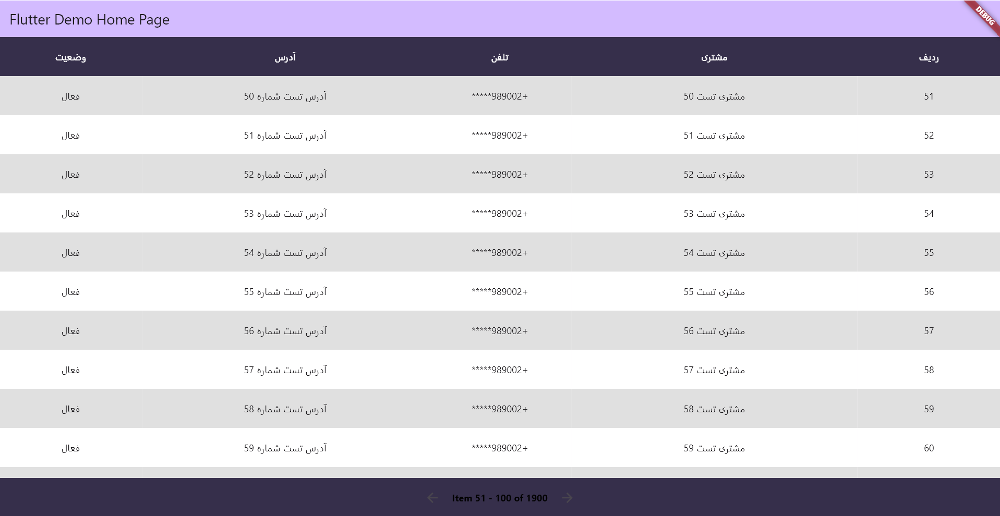

# flutter_persian_table

<p align="center">
   
</p>

<p align="center">
   
</p>


A Flutter package to display tabular data with pagination.

## Installation
Add the latest version of package to your pubspec.yaml:

```yaml
dependencies:
zikey_data_table: ^0.0.1
```
Import the package:

```dart

import 'package:flutter_persian_table/persian_table_widget.dart';
import 'package:flutter_persian_table/src/pr_table_data.dart';

```
See the example for sample usage.

## Usage
```dart
  @override
  Widget build(BuildContext context) {
    final List<PrTableHeaderInfo> header = [
      PrTableHeaderInfo(name: "ردیف", isExpanded: false),
      PrTableHeaderInfo(name: "مشتری", isExpanded: true),
      PrTableHeaderInfo(name: "تلفن", isExpanded: false),
      PrTableHeaderInfo(name: "آدرس", isExpanded: true),
      PrTableHeaderInfo(name: "وضعیت", isExpanded: false),
    ];

    List<PrTableRowInfo> rowItems = [];

    for (int i = 0; i < 1900; i++) {
      PrTableRowInfo row = PrTableRowInfo(
        id: i,
        rowItems: [(i+1).toString(),"مشتری تست $i", "+989002*****", "آدرس تست شماره $i", "فعال"],
      );
      rowItems.add(row);
    }

    return Scaffold(
        appBar: AppBar(
          backgroundColor: Theme.of(context).colorScheme.inversePrimary,
          title: Text(widget.title),
        ),
        body: PersianTableWidget(
          columnHeaders: header,
          tableHeight: double.infinity,
          tableData: rowItems,
        ));
  }
```

See the example directory for more information.

 
